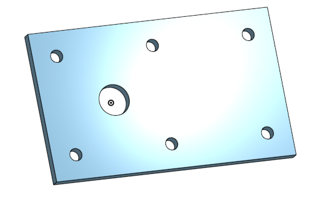

# Basic_Onshape_CAD

https://cvilleschools.onshape.com/documents/3947cf5164693d02cafed0e4/w/23c7aaeca2be2d465fe6b4d9/e/ea51eadba9f8ee33f2e575b3
I commpleated The Base I did not have very much trobble making it because the instroctions were relitivley simple and clear. I did however, struggle a little when I needed to use the linear pettern function, but I figered it out after a little bit of thinking and it was all good.
